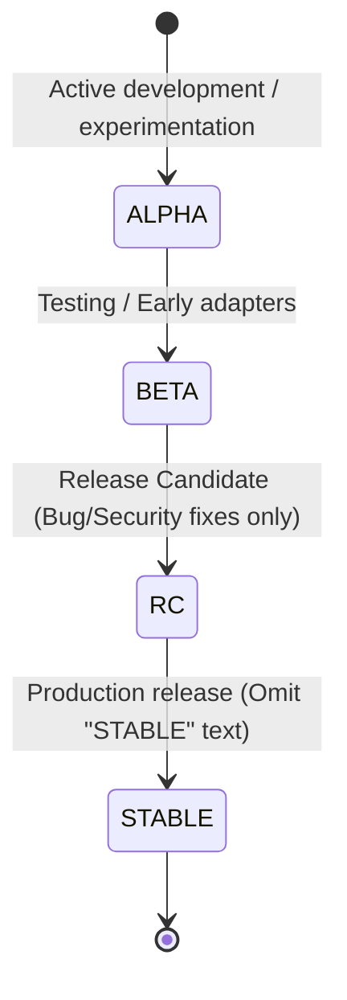

# Release Management & Tagging Strategy 🚀

This document defines the official **Release Management Guide** and **Git Tagging Strategy** for the **Survey Designer** project. It is based on industry best practices and adapted from the *Release Management GuideBook* to fit our **decoupled mono-repo trunk-based development** model.

By following these rules strictly and without exception, we ensure reliability, public API stability, and seamless upgrades for our users and system deployers.

---

## 📐 1. Semantic Versioning (SemVer)

We strictly adhere to **Semantic Versioning 2.0.0** (`MAJOR.MINOR.PATCH`) to communicate the nature of changes in every release:

$$V_{version} = \text{MAJOR} . \text{MINOR} . \text{PATCH}$$

| Segment | Meaning | Backward Compatible? | Triggers / Examples |
| :--- | :--- | :--- | :--- |
| **MAJOR** | Breaking changes | ❌ No | Major database schema migrations, complete architectural redesigns, or breaking API changes. |
| **MINOR** | New features |  Yes | Adding a new survey export format, introducing new wizards, or adding deprecation warnings for future removals. |
| **PATCH** | Bug & security fixes |  Yes | Fixing a validation glitch in a React component, upgrading a sub-dependency to patch a CVE, or correcting a backend typo. |

---

## 🏷️ 2. Git Tagging & Release Suffix Strategy

All software releases must be marked with a corresponding Git tag. To avoid confusion with branch names and maintain consistency across environments, we follow these precise naming rules:



### Tag Formatting Rules
1. **The `v` Suffix:** All version numbers must be prefixed with a lowercase **`v`** (e.g., `v2.0.0`, `v2.0.0-BETA1`).
2. **Stability Indicators:** Stability suffixes must always be written in **uppercase** and spelled out fully:
   * `vX.Y.Z-ALPHA1`, `vX.Y.Z-ALPHA2` (for internal testing and core developers).
   * `vX.Y.Z-BETA1`, `vX.Y.Z-BETA2` (for early adopters and external staging testing).
   * `vX.Y.Z-RC1`, `vX.Y.Z-RC2` (Release Candidates, code-frozen except for critical security/bug fixes).
3. **Omitting `STABLE`:** Never include the word `STABLE` within git tags or release names. A version without a suffix (e.g., `v2.0.0`) is implicitly understood as stable.

> [!IMPORTANT]
> **Starting Release Tag:** The starting version tag for this repository under this release framework is strictly **`v2.0.0`**. Any pre-release versions (e.g., `v2.0.0-ALPHA1`, `v2.0.0-BETA1`) will culminate in the first stable release of our decoupled mono-repo tagged exactly as `v2.0.0`.

### Special Metadata Badges

#### 🛡️ Security Releases: `[SECURITY RELEASE]`
If a release includes critical security patches (such as fixing a high-severity CVE or patching an authentication bypass), suffix the release title with `[SECURITY RELEASE]`:
```text
Release v1.2.1 [SECURITY RELEASE]
```

#### ⚠️ Broken Releases: `[YANKED]`
A release is considered broken and must be **yanked** if it contains syntax/lint errors, broken build installers, accidental debug flags, or breaking changes violating our compatibility promise.
* **Never reuse or replace a git tag.**
* Update the release title on GitHub by appending `[YANKED]`:
  ```text
  Release v1.2.0 [YANKED]
  ```
* Immediately publish a follow-up release with an incremented version number (e.g., `v1.2.1`).

---

## 🔄 3. Major Release Paths

Depending on the scale of changes, major releases must follow one of three stability and transition paths:

### A. Pre-1.0 (Initial Development)
* **API Stability:** No API stability should be expected.
* **Stability Path:** `ALPHA` $\rightarrow$ `BETA` $\rightarrow$ `RC` $\rightarrow$ `STABLE`
* **Guideline:** Keep the support lifecycle for pre-1.0 minor versions short (under 2 months) to avoid blocking progress. Never break the API between patch releases.

### B. Transitional Release (Preferred)
* **Goal:** Provide a smooth, friction-free upgrade path for users.
* **Mechanism:** The *final minor version* of the previous Major release must contain deprecation warnings for any code or APIs to be removed.
* **Stability Path:** `BETA` $\rightarrow$ `[RC]` $\rightarrow$ `STABLE` (RC may be skipped if testing is stable enough).
* Once the deployer addresses all deprecation warnings, they can seamlessly upgrade to the new Major version.

### C. Refactor Release (Radical Upgrade)
* **Goal:** Address radical structural changes where a deprecation bridge is technically impossible (e.g., major system package upgrades or programming language runtime upgrades).
* **Stability Path:** `ALPHA` $\rightarrow$ `BETA` $\rightarrow$ `RC` $\rightarrow$ `STABLE`
* **Guideline:** Refactor releases must be extremely rare. There must be at least two stable Major releases between refactor releases.

---

## 🗒️ 4. Changelogs & Upgrades

### Keeping a Changelog (`keepachangelog.com`)
We maintain a human-readable history of changes grouped by category.

> [!IMPORTANT]
> To ensure deployers and users do not overlook critical fixes, the **Security** category must always be placed at the very top of the changelog list, followed by other categories.

Categories must be ordered exactly as follows:
1. **`Security`** (Critical patches and vulnerability fixes)
2. **`Added`** (New features and capabilities)
3. **`Changed`** (Modifications to existing behavior)
4. **`Deprecated`** (Features to be removed in future releases)
5. **`Removed`** (Features removed in this release)
6. **`Fixed`** (Bug fixes)

### Upgrade Instructions (`UPGRADE.md`)
Step-by-step upgrade instructions and migration guides must be provided in `docs/UPGRADE.md`. If the instructions become too long or complex, they can be broken into version-specific documents (e.g., `docs/UPGRADE-1.2.md`).

---

## 🛠️ 5. Technical Git Release Workflow

To publish a release, the release coordinator executes the following workflow:

```bash
# 1. Ensure you are on the main branch with all tests passing
git checkout main
git pull origin main

# 2. Compile changelog and bump version numbers in package.json and pyproject.toml
# Ensure UPGRADE.md has been updated if there are database or setup migrations

# 3. Create a signed Git Tag with a descriptive release message
git tag -a v2.0.0 -m "Release v2.0.0"

# 4. Push the tags to the remote repository
git push origin v2.0.0
```

> [!NOTE]
> Pushing a version tag matching the `v*` pattern automatically triggers our continuous integration pipeline to package the frontend production assets, build the Django production Docker image, and publish the release artifacts.
